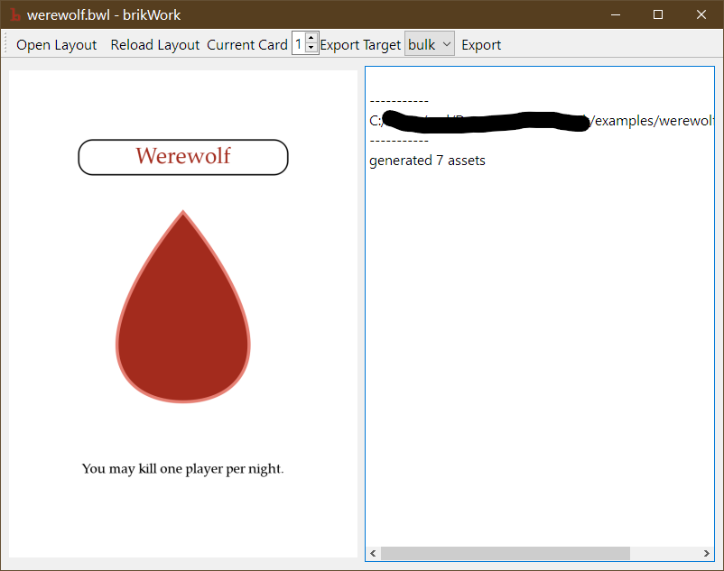

# Getting Started 2

In chapter 1 we looked at a simple layout for a set of cards for Werewolf. This chapter will continue working on those cards.

## The Rect Element

brikWork offers some limited elements for drawing shapes. We'll be looking at `rect` but there's also `circle` and `line`. Shapes are great for placeholders until you get final graphics, simple layouts, or colorizing transparent images. The color of the shape and the line used to draw the shapes are also fairly flexible, check out the section on [Element Shapes](../Elements-and-Properties/#the-shape-elements) for more.

So, let's look at a simple border.

    role-border {
        type: rect
        position: center, .5in
        size: 1.5in, .25in
        corner-radius: .1in
    }

Pretty easy! We give it the same position and size as the role element so it fits, and the `corner-radius` property rounds the corners slightly. Just put this **before** the role section and let's take a look

Looks good, but there's a problem. Because we put the same size and position in two places, if we want to move the role we have to change things in two places. We can fix that by putting the elements in a container.

    role-container {
        position: center, .5in
        size: 1.5in, .25in
        
        border {
            type: rect
            size: 100%, 100%
            corner-radius: .1in
        }
        
        role {
            type: text
            size: 100%, 100%
            font: 36pt, Palatino Linotype
            font-color: [if| [eq| [role] | werewolf ] | [dark-red] | black ]
            align: center, middle
            text: [capitalize| [role] ]
        }
    }

A container is any element that holds another element, as shown. An element in another element is a subelement. If an element has no other container then the layout can be thought of its container. Any element can be a container, but elements without types are recommended. Containers affect their subelements in a few ways
 
 - The position of a subelement is based on the location and rotation of its container.
 - When the size of a subelement is given as a percent its size is proportional to its container
 - Subelements are drawn after their container.

This gives us the benefit of separation of concerns, which is programmer talk for "different things in different places, so separate things can do the same thing". You don't have to put everything in a container, but when you have multiple elements of the same size at the same place containers certainly help. Other places you might want to use a container.

 - position one element relative to another.
 - a set of elements that will always be next to each other, but don't have a final position
 - you want to define a size as a percent of another element's size

## Inverse Position

While we're on the subject of positioning, let's talk inverse positions. Normally, positions are based on the upper left, where a given element's upper left is relative to its container's upper left. Some times you want to position an element based on its lower or right edge. This is the purpose of inverse positioning. We'll look at this by adding a description of the role to the bottom of the cards.

    description {
        type: text
        position: center, ^.5in
        size: 2in, .3in
        font-family: Palatino Linotype
        align: center, middle
        text: [description]
    }

    data {
    repeat, role, description
    2, werewolf, You may kill one player per night.
    1, seer, You may find out the role of one player per night.
    4, villager, You have no abilities.
    }

An inverse position is indicated with a caret before the number. In this case the description will have it's bottom a half inch from the bottom of the card. Inverse Positions can be mixed with normal positions to specify any corner, such as `position: ^.25in, 25in` to specify a quarter inch from the upper right corner.

Let's take a look then we'll go over a few final points.

Neat!

## The Defaults Section

Because our two text boxes use the same font, we can make use of the `defaults` section.

    defaults {
        font-family: Palatino Linotype
    }

The `defaults` section sets default values for every element in the layout. Any property can be defined in the `defaults` section, even size and position. This is handy any time multiple elements use the same value and you only want to define it in one spot.

## Image Positioning

Images can be a little weird to position. We have a simple example and our images are about the same size so there isn't much to do. For more complex positioning of images of different sizes, use an `image-box` element. It works like an `image` element, with an added `align` property paired with a defined size to position images within that size. Check it out [here](../Elements-and-Properties/#the-image-elements) to familiarize yourself with it, and how the `image` element works.

## Last Look at the Cards

Finally, here's everything all together.

    layout {
        size: 2.5in, 3.5in
    }

    export {
        output: cards
        bulk {
            name: [role][repeat-index].png
        }
    }

    briks {
        dark-red = #a32b1d
    }

    defaults {
        font-family: Palatino Linotype
    }

    role-container {
        position: center, .5in
        size: 1.5in, .25in
        
        border {
            type: rect
            size: 100%, 100%
            corner-radius: .1in
        }
        
        role {
            type: text
            size: 100%, 100%
            font: 36pt, Palatino Linotype
            font-color: [if| [eq| [role] | werewolf ] | [dark-red] | black ]
            align: center, middle
            text: [capitalize| [role] ]
        }
    }

    icon {
        type: image
        position: center, 1in
        source: images/[role].png
    }

    description {
        type: text
        position: center, ^.5in
        size: 2in, .3in
        font-family: Palatino Linotype
        align: center, middle
        text: [description]
    }

    data {
    repeat, role, description
    2, werewolf, You may kill one player per night.
    1, seer, You may find out the role of one player per night.
    4, villager, You have no abilities.
    }

And the cards

Neat! This final card is included with brikWork in the example folder, so take a look at that if you haven't been following along.